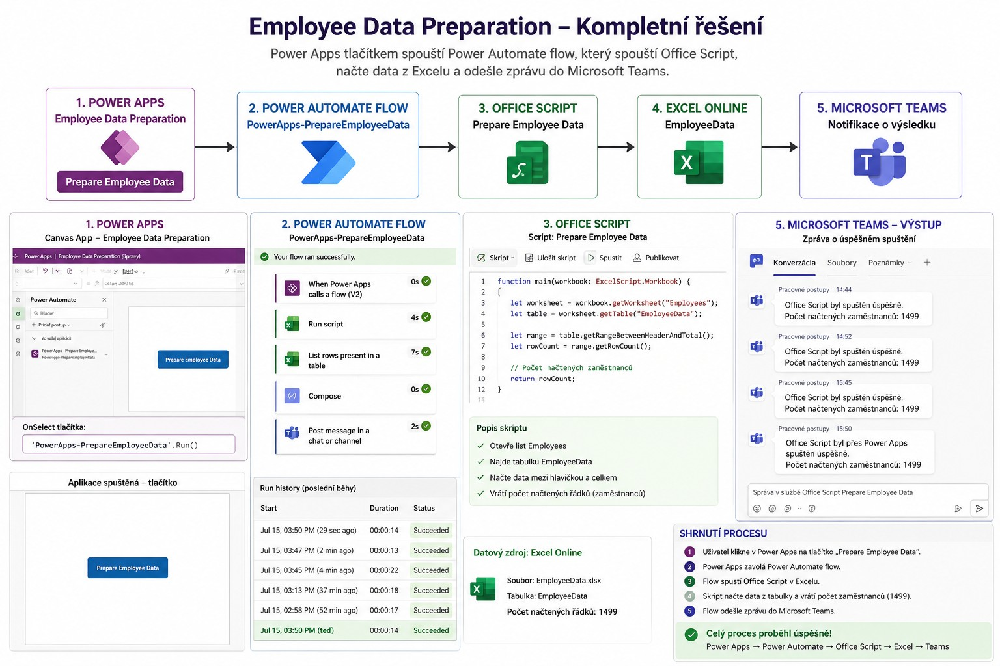

# Employee Data Preparation V2 – Power Apps Integration / Employee Data Preparation V2 – Integrace Power Apps



| 🇬🇧 English | 🇨🇿 Česky |
|------------|-----------|

| ## **Overview** | ## **Přehled** |

| This version extends the previous Employee Data Preparation workflow by adding a Power Apps Canvas App. Instead of starting the automation directly from Power Automate, users can now launch the entire process with a single button inside the application. | Tato verze rozšiřuje předchozí workflow Employee Data Preparation o aplikaci Power Apps Canvas App. Místo ručního spuštění z Power Automate lze nyní celý proces spustit jediným tlačítkem přímo z aplikace. |
| The solution demonstrates an end-to-end integration between Power Apps, Power Automate, Office Scripts, Excel Online and Microsoft Teams. | Řešení ukazuje kompletní integraci mezi Power Apps, Power Automate, Office Scripts, Excel Online a Microsoft Teams. |

---

## Solution Architecture / Architektura řešení

```text
Power Apps
     │
     ▼
Power Automate
     │
     ▼
Office Script
     │
     ▼
Excel Online
     │
     ▼
Microsoft Teams Notification
```

---

| 🇬🇧 English | 🇨🇿 Česky |
|------------|-----------|
| ## **Workflow** | ## **Průběh** |
| 1. User opens the Power Apps application. | 1. Uživatel otevře aplikaci Power Apps. |
| 2. The **Prepare Employee Data** button starts a Power Automate flow. | 2. Tlačítko **Prepare Employee Data** spustí Power Automate Flow. |
| 3. The flow runs an Office Script in Excel Online. | 3. Flow spustí Office Script v Excel Online. |
| 4. The script prepares the EmployeeData table. | 4. Script připraví tabulku EmployeeData. |
| 5. Power Automate reads the processed data. | 5. Power Automate načte zpracovaná data. |
| 6. Microsoft Teams receives a confirmation message with the processed employee count. | 6. Microsoft Teams odešle potvrzení o úspěšném zpracování včetně počtu zaměstnanců. |

---

# Challenges and Solutions / Problémy a jejich řešení

| Problem | Solution | Result |
|---------|----------|--------|
| **Power Automate did not return the correct number of employees because the Excel table mapping was incorrect.** | The Excel table configuration and mapping were corrected. After updating the table reference, Power Automate was able to access the correct data. | The flow now reads all employee records correctly (1499 employees). |
| **Power Automate nevracel správný počet zaměstnanců kvůli špatně namapované tabulce v Excelu.** | Opravila jsem konfiguraci tabulky a její mapování. Po správném nastavení odkazu na tabulku začal Power Automate pracovat se správnými daty. | Flow nyní správně načítá všech 1499 zaměstnanců. |

---

| Problem | Solution | Result |
|---------|----------|--------|
| **The Office Script did not initially process the workbook correctly and occasionally failed while reading the table.** | The Office Script logic was reviewed and adjusted to correctly locate the worksheet and EmployeeData table before processing. | The script now executes reliably and returns the correct number of employees. |
| **Office Script zpočátku správně nezpracovával sešit a občas selhával při načítání tabulky.** | Upravila jsem logiku Office Scriptu tak, aby správně našel list i tabulku EmployeeData před samotným zpracováním. | Script nyní probíhá spolehlivě a vrací správný počet zaměstnanců. |

---

| Problem | Solution | Result |
|---------|----------|--------|
| **Power Apps was not connected to the flow at the beginning.** | I added the Power Automate flow to the Canvas App and configured the button to call the flow using the Run() function. | Users can now start the complete automation directly from the Power Apps interface. |
| **Power Apps zpočátku nebyly propojeny s Flow.** | Přidala jsem Power Automate Flow do Canvas aplikace a nastavila tlačítko pomocí funkce Run(). | Celou automatizaci lze nyní spustit jediným kliknutím z Power Apps. |

---

| Problem | Solution | Result |
|---------|----------|--------|
| **The Teams notification did not clearly indicate that the process had been started from Power Apps.** | The notification message was updated to include the Power Apps context. | Teams now clearly confirms that the Office Script was started from Power Apps and shows the processed employee count. |
| **Notifikace v Teams neuváděla, že proces byl spuštěn z Power Apps.** | Upravila jsem text zprávy o informaci, že Office Script byl spuštěn prostřednictvím Power Apps. | Teams nyní jednoznačně potvrzuje spuštění z Power Apps i počet zpracovaných zaměstnanců. |

---

## Technologies / Použité technologie

| 🇬🇧 English | 🇨🇿 Česky |
|------------|-----------|
| • Power Apps Canvas App | • Power Apps Canvas App |
| • Power Automate | • Power Automate |
| • Office Scripts | • Office Scripts |
| • Excel Online (Business) | • Excel Online (Business) |
| • Microsoft Teams | • Microsoft Teams |

---

## Final Result / Výsledek

| 🇬🇧 English | 🇨🇿 Česky |
|------------|-----------|
| The complete Employee Data Preparation process can now be started from a single button inside Power Apps. The workflow successfully integrates Power Apps, Power Automate, Office Scripts, Excel Online and Microsoft Teams into one automated business process. | Celý proces Employee Data Preparation lze nyní spustit jediným tlačítkem v Power Apps. Workflow úspěšně propojuje Power Apps, Power Automate, Office Scripts, Excel Online a Microsoft Teams do jednoho automatizovaného firemního procesu. |

---

## Version

**V1**
- Office Script
- Power Automate
- Excel Online
- Microsoft Teams

**V2**
- Power Apps integration
- Power Apps button triggers Power Automate
- Improved Office Script reliability
- Improved Excel table mapping
- Enhanced Microsoft Teams notifications

---

**Author**

**Denisa Pitnerová**

Junior Microsoft 365 | Power Platform | Automation | AI Workflows
